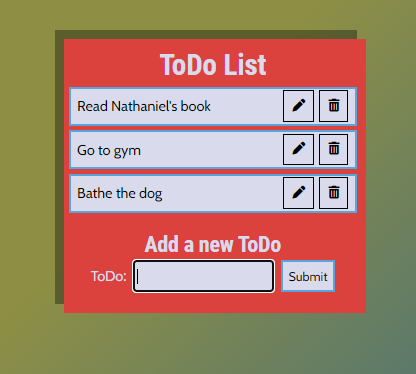

# To Do List App

## Description

This app lets you add things that you aim to do, that is, your todos. It is possible to add, delete, edit and mark as todos as done. Here's a preview of the app which was build using React:

## How to run the app

In the project directory, run:

### `npm install`

And then:

### `npm start`

After a few moments, the app will open in your browser and, if not, go to the link [http://localhost:3000](http://localhost:3000).